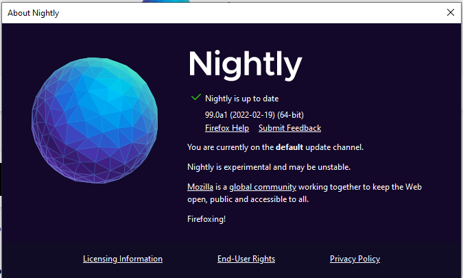

# Change some strings

## Newtab title

From: https://www.youtube.com/watch?v=Hx42tyEWPxk, by Aphrx

Navigate to _C:\mozilla-central\browser\locales\en-US\browser\newtab\newtab.ftl_

At the time of writing, line 7 states:

```
newtab-page-title = New tab
```

Change it to:

```
newtab-page-title = Firefoxing!
```

Then compile and run again:

```
mach build
mach run
```

## About dialog 

Located in _browser\locales\en-US\browser\aboutDialog.ftl_

Change line 48 (aprox.) from:

```
helpus = ...
```

to:
```
helpus = Firefoxing!
```

Then compile and run:

```
mach build
mach run
```

And check the About dialog in `☰ > Help > About Firefox`



Check the expression _Firefoxing!_ appears in it.